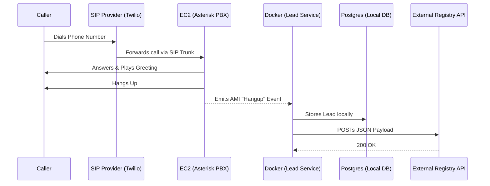

# Telephony Lead Ingestion

A robust, provider-agnostic telephony infrastructure template designed to intercept incoming calls, play a custom greeting, and forward the caller details to an external registry system as a JSON payload.

## Architecture Overview

This project consists of two main components:
1. **The Telephony Engine (Asterisk/FreePBX)**: Hosted on AWS EC2, provisioned automatically via Terraform. Handles the SIP connection from your provider (like Twilio), answers the call, plays a message, and emits a `Hangup` event over the Asterisk Manager Interface (AMI).
2. **The Lead Service (Java Spring Boot)**: Hosted as a Docker container. Connects directly to the Asterisk AMI, listens for `Hangup` events, extracts the caller ID, saves the lead to a local Postgres database, and forwards the data to your chosen API endpoint.

## Features
- **Infrastructure as Code**: The entire Asterisk PBX is deployed and configured using Terraform. It automatically handles NAT, security groups, SIP transport configurations, and AMI bindings.
- **Provider Agnostic**: Easily swap out Twilio for any other SIP provider. The Terraform variables allow you to configure custom SIP domain URIs and IP allowlists.
- **Resilient**: The `lead-service` will auto-reconnect to the PBX if the connection drops. If the external registry API goes down, the lead is still safely captured in the local Postgres database for future manual/automated recovery.
- **Admin Ready**: Comes with pgAdmin pre-configured to easily view your captured leads directly in the browser.

## Getting Started

Ready to deploy your own telephony infrastructure?

👉 **Head over to the [Setup Guide](infra/SETUP.md)** to provision the cloud infrastructure and start the Docker services.