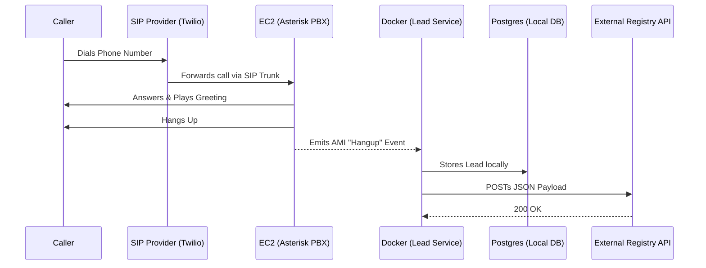

# Telephony Lead Ingestion

## Architecture Overview

Consists of two main components:
1. **The Telephony Engine (Asterisk/FreePBX)**: Hosted on AWS EC2, provisioned automatically via Terraform. Handles the SIP connection from your provider (like Twilio), answers the call, plays a message, and emits a `Hangup` event over the Asterisk Manager Interface (AMI).
2. **The Lead Service (Java Spring Boot)**: Hosted as a Docker container. Connects directly to the Asterisk AMI, listens for `Hangup` events, extracts the caller ID, saves the lead to a local Postgres database, and forwards the data to your chosen API endpoint.

## Getting Started

👉 **Head over to the [Setup Guide](infra/SETUP.md)** to provision the cloud infrastructure and start the Docker services.
